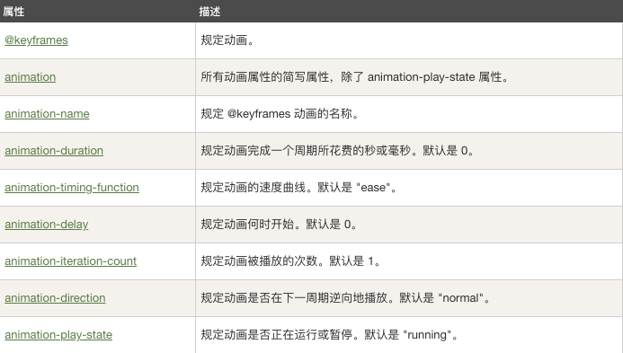

css3中，我们可以创建动画，它可以取代许多网页动画图像，Flash动画，和Javascript。  
<!--more-->
### css3 @keyframes 规则  

要创建CSS3动画，你将不得不了解@keyframes规则。

@keyframes规则是创建动画。 @keyframes规则内指定一个CSS样式和动画将逐步从目前的样式更改为新的样式。  


@keyframes myfirst
{
    from {background: red;}
    to {background: yellow;}
}

@-webkit-keyframes myfirst /* Safari 与 Chrome */
{
    from {background: red;}
    to {background: yellow;}
}
  

在@keyframes 中创建动画后，需要绑定到一个选这起，否则动画不会有任何效果。  
指定至少两个CSS3的动画属性绑定向一个选择器：  

* 规定动画的名称  
* 规定动画的时长  


div
{
    animation: myfirst 5s;
    -webkit-animation: myfirst 5s; /* Safari 与 Chrome */
}
   

**注意:** 您必须定义动画的名称和动画的持续时间。如果省略的持续时间，动画将无法运行，因为默认值是0。 

除了设置from、to还可以设置动画过程的百分比，例如：
  
@keyframes myfirst
{
    0%   {background: red;}
    25%  {background: yellow;}
    50%  {background: blue;}
    100% {background: green;}
}

@-webkit-keyframes myfirst /* Safari 与 Chrome */
{
    0%   {background: red;}
    25%  {background: yellow;}
    50%  {background: blue;}
    100% {background: green;}
}
  

还可以在加上position的位置属性，做出移动加变色的动画：

div {
  position: relative;
  height: 100px;
  width: 100px;
  background-color: blue;
  animation: move 5s;

}
@keyframes move {
  0% {background-color: blue; left: 0; top:0;}
  25% {background-color: yellow; left: 100px; top:100px;}
  50% {background-color: black; left:200px;top:100px;}
  75% {background-color: red; left:100px; top:0;}
  100% {background-color: red; left:0; top:0;}
}
  

[示例](https://jsfiddle.net/caogu/5dm7ptL0/9/)可以看看动画的效果！  

### CSS3的动画属性  

